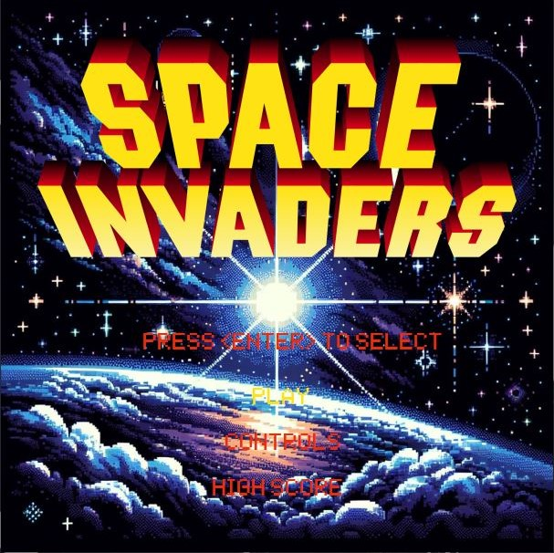
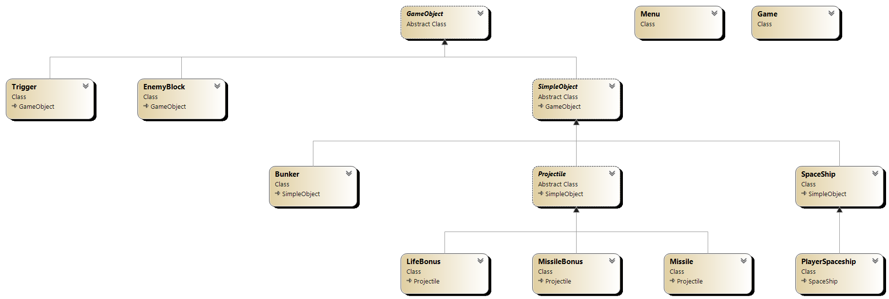

# Space Invaders

[Space invaders project](https://perso.esiee.fr/~perretb/I3FM/POO1/projet/) (tutorial in French) made by Zackary Saada & Antonin Mansour.

   
 

## Requires 

- Visual Studio 2017+
- .net 4+

## Documentation

- Report (in French) can be found in [Docs/3I-PR3_Rapport_SpaceInvaders_MANSOUR_SAADA.pdf](Docs/3I-PR3_Rapport_SpaceInvaders_MANSOUR_SAADA.pdf).
- Class Diagram can be found in [Docs/SpaceInvadersClassDiagram.png](Docs/SpaceInvadersClassDiagram.png) or below :

